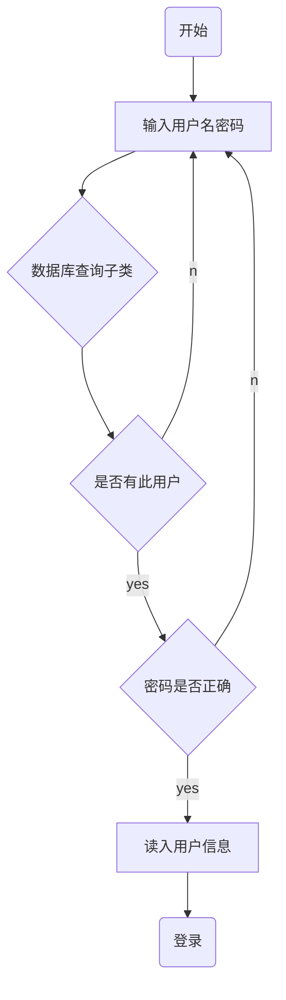

## 概要
在这里填写博客内容

```mermaid
graph TB
start(开始)-->inputA[输入用户名密码]
inputA-->opA{数据库查询子类}
opA-->conditionA{是否有此用户}
conditionA--yes-->conditionB{密码是否正确}
conditionA--no-->inputA
conditionB--yes-->opB[读入用户信息]
conditionB--no-->inputA
opB-->en(登录)
```

