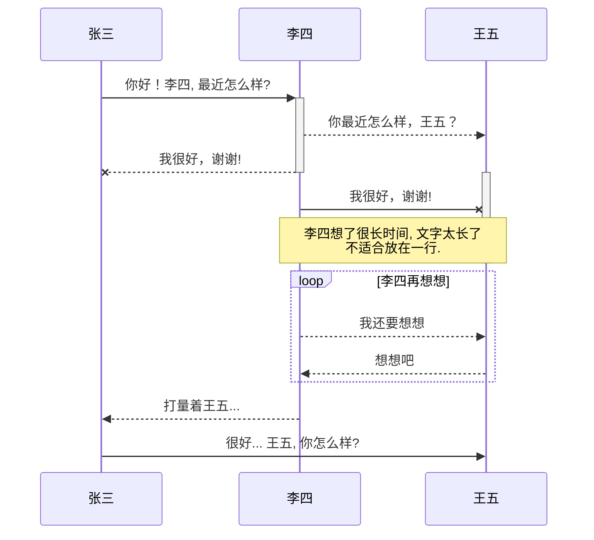

## 概要
用于测试多终端同步

用win10系统上传的，在mac上done下来的，现在编辑后，在push一下，看看效果.
push成功  再测试一下git push -u origin hexo    成功！
测试push简化操作   git push 
全部提交到了远程仓库中，而且win10终端也已经把代码done了下来，接下来要再进行push 了

现在到mac上了

mac上的nodejs 是v12.16.3版本
windows上的是V16版本
mac上更新到最新V17版本之后，也不能部署了，又恢复到了V12版本，才可以继续使用

Win10上的nodejs是自助安装的，并没有使用NVM等工具进行管理
打算把Win10上的nodejs先卸载掉，然后NVM下载mac上对应的nodejs版本

没想到配置一样后，居然成功了，弄了一周啊。。。。。

* 士大夫

* 士大夫
	- sublime的markdown编辑器使用
	1. 插件
	2. 还是馋
	3. 事实刷新测试
	

流程图测试

