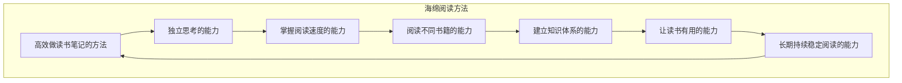
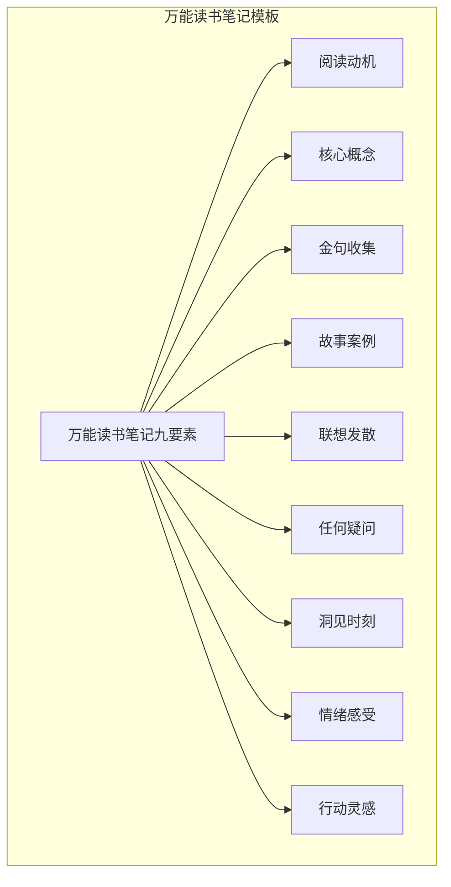

# 海绵阅读方法的七大能力

```mermaid
graph TB
subgraph 海绵阅读方法
a[高效做读书笔记的方法]
b[独立思考的能力]
c[掌握阅读速度的能力]
d[阅读不同书籍的能力]
e[建立知识体系的能力]
f[让读书有用的能力]
g[长期持续稳定阅读的能力]
a-->b
b-->c
c-->d
d-->e
e-->f
f-->g
g-->a
end
```

```mermaid
graph TB
subgraph 万能读书笔记模板
a[万能读书笔记九要素]
b[阅读动机]
c[核心概念]
d[金句收集]
e[故事案例]
f[联想发散]
g[任何疑问]
h[洞见时刻]
i[情绪感受]
j[行动灵感]
end
a-->b
a-->c
a-->d
a-->e
a-->f
a-->g
a-->h
a-->i
a-->j
```

