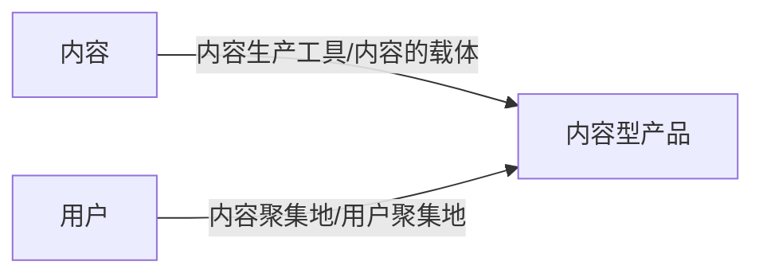
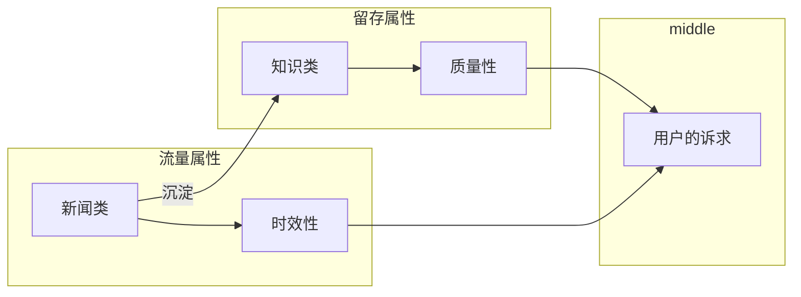

# 内容运营1

## 思维方式

### 平台思维

平台内容运营，互联网内容基础设施的搭建者 

案例：

* 抖音
* 快手
* 微博
* 知乎

### 散户思维

新媒体运营，内容型平台的使用者

案例：

* 教育
* 零售
* 销售驱动

## 互联网内容型产品有哪些

### 产品分类

web1.0门户：

* 新浪网
* 搜狐网
* 雅虎
* 新华网
* 人民网

web2.0SNS

* Facebook
* Twitter
* Instagram
* 国内的微博
* 微信
* QQ
* 陌陌
* 豆瓣
* 贴吧

内容模块（融合时代）

* 抖音橱窗
* 淘宝直播

### 分类要素

生产和分发方式。不同的产品使用不同的生产和分发方式

用户的身份和职业信息：

* 身份职业均公开 如脉脉
* 身份职业都不公开 微信
* 职业公开身份 领英
* 身份公开 职业不公开

互动形式：

* 全公开 微博
* 半开半闭
* 全封闭 如微信私聊

### 有哪些作用

## 什么事互联网内容

内容运营指的是负责互联网产品中内容的产出和分发的岗位

### 按属性分类

#### 新闻类：

带有时效性，具有流量属性

#### 知识类：

如豆瓣影评，具有留存属性

看新闻是用微博还是抖音?学知识是用喜马拉雅还是抖音？杀时间是抖音还是知乎？

### 按照内容展现形式分类

## 内容运营岗位

## 什么是互联网内容运营

