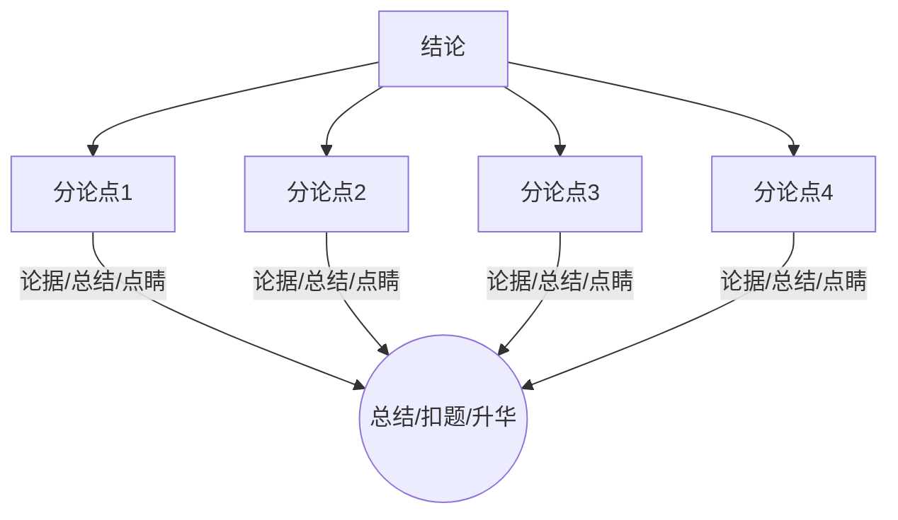
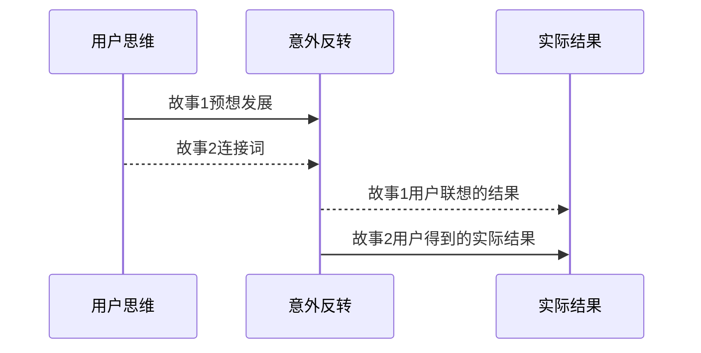
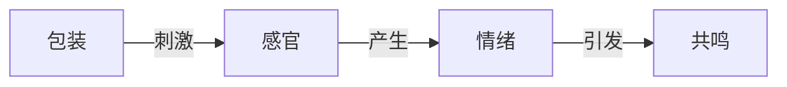

# 内容运营2
## 写标题的10个方法

标题党：内容与标题不一致，相差悬殊

### 拟题原则的三个注意事项

* 精：就是概括，标题要高度概括文章内容，不拖泥带水
* 切：切题，要抓住文章内容与用户之间的主要矛盾
* 巧：巧就是技术，标题过于直白，要含蓄，要有意境

### 写标题的10个方法

#### 谐音式

谐音式指利用汉字同音或近音来替代文字并产生有趣的修辞格，即利用谐音来表达消息的隐含意思。需要借鉴生活中的歇后语，常引用成语等耳熟能详的语句，然后用同音字或颠倒循序等 方式重新组合。这种方式不仅提升了标题的视觉冲击力，也提升了标题的可读性，谐音式的精髓式利用用户语音的惯性思维制造悬念，进而抓住用户的猎奇心理

#### 疑问式

疑问式以设问或反问的形式表达观点，输出用户心中的疑问，进而引起用户的兴趣、思考和共鸣。用户心中充满疑问，但是他们并不知道疑问点在哪里，此时如果用一个疑问句把用户心中想提出来便可以让用户感觉你非常懂他

案例：
* 那些年毕业进入国企的同学，十年后过得怎么样
* 从魔鬼到上帝的转变，周琦到底经理了什么

#### 引用式

引用式指标题使用现成的话语，包括成语、谚语、歌词、歌名、诗词、歌谣、地名等来概括内容和表达感情的方式。流传来的歌词、诗词都是经过时间考验的，巧妙地运用不仅让用户拍手叫绝也能产生熟悉的感觉，一石二鸟。

案例：
* 樱色满员“武”不住，10万游客赏花来
* 19岁消防员舍身救人，特别的锦旗给特别的你！
        
        

#### 悬念式

指标题中给读者留下悬念。悬念能诱发读者的好奇心，并引导用户的思路去该去的地方。悬念式标题只负责抛出问题，而非直接陈述，问题的答案需要用户自己阅读文章去寻找

案例：
* 《月赚三千和月入三万的人有何不同》
    * 此案例说出A与B的不同而不告知原因
    * 具体方法为A现象+B现象+疑问句
* 《原来PPT还有这么多小技巧》
    * 此案例说出某件反常的事情，把答案隐藏起来让读者自己去寻找
    * 具体方法为反常事件+惊叹句，这里的惊叹不能带有任何引导性，只能表达惊讶的意思

#### 排布式

排比式指三个或以上意义相关、相近、结构相同或相似的词组或句子并排在一起组成的标题，有时候两个句子或以上的并列句子也可以成为排比式。排比式的句式更能突出重点，是一种表达情感的强烈手段。

案例：

* 《热！热！热！北京气温飙升到43度》
* 《移动支付改变生活：不带钱包了、花钱没感觉了、月光的更快了》

#### 借势式

借势式指借用名人、地名等一些具有高声望、高知名的名词撰写标题的方法。借鉴的名词本身具有大流量，它们的出现会引起用户的高度关注。两层含义：一层高知名度名词本身就是带量的词汇，很容易提升点击率。第二层是名人具有权威性，可以提升用户的信任度。

案例：

* 《郎朗练琴吃了很多苦，作为家长一定要明白这些道理！》
* 《马云说成功的男人都有这些特质，赶快学一学》

#### 数字式

数字式指标题中使用阿拉伯数字或强调数据。用户对极端数字或者不可能发生的数字有天然的敏感性。用户的数学水平不一定很高，但是天生对不可能达到的数字敏感。数字式标题可以增强差异性，同事也可以增强文字的说服力。

案例：

* 《孩子一个月学会8000个单词，VIPKID是怎么做到的！》，突出8000这个数字，一个月学会8千个单词是非常困难的一个人物，8千打破了用户的日常认知。
* 《XXX贪污的现金有一吨重，足足拉了两卡车》，用重量数字对现金进行藐视，用户对金钱的理解习惯上是金额，比如多少万，很少用重量进行衡量，一个高官贪污几个亿早已不是什么新鲜事，但是用重量衡量现金金额给用户带来了一个数字上的反差冲击。

#### 感染式

感染式指标题描述的一种感觉、一段情绪、把用户带入其中。用户有丰富的情绪，通过文字的描述调动起用户的情绪以更好地产生共鸣。这种情绪可以是悲伤、喜悦、高亢、激动等。

案例:

* 《一家6口搭乘了MH17全部遇难》
* 《3天支持了1桶泡面，消防官兵的精神深深地震撼了我们》

#### 场景式

场景式指用文字描述一个场景、还原一个场景、制造一个场景、进而去刺激用户的感官

案例：

* 《霾霾霾北霾霾霾霾霾方霾霾霾》
* 《一个馒头、一杯凉水、一袋榨菜这是他最好的生日礼物》

#### 创新式

标题形式不是一成不变的，实际运用不要拘泥于形式，只要是让用户眼前一亮，标题形式都可以。创新说来容易做起来难，需要运营人员多去浏览、多去积累。

案例：

* 《3米厚的大雪，零下50度的严寒，运输队顺利送达救援物资》
* 《我们又双叒叕要换首相了》

## 文章的四种类型

#### 知识类

提出某个问题并对问题进行解答的文章。它可以是为某个事物下定义，也可以针对某个问题做更详细、更深入的解说。

| 文章类型 | 解释   | 描述                                             |
| -------- | ------ | ------------------------------------------------ |
| 信息型   | 是什么 | XXX是什么，有几种模式、怎么使用、有什么好处      |
| 问题型   | 为什么 | 导致XXX的原因，XXX背后的秘密                     |
| 指导型   | 如何做 | XXX五步法，XXX操作流程，XXX实操方案，XXX注意细节 |
| 罗列型   | 多少种 | XXX十大种类，XXX五个理由，XXX的三个方法          |

#### 鸡汤类

指特别励志、非常煽情、充满正能量的文章。惯用手段是向上归类法，由一个特别小的事情或者由头上升到哲学、国家、人生的高度。作用就是给用户“心理按摩”，通过文字引起用户状态的变化，达到身心放松。

| 文章类型 | 特点     | 描述                                                         |
| -------- | -------- | ------------------------------------------------------------ |
| 励志型   | 有故事   | 人物痛苦的故事情节+积极的人生哲理，让读者充满鸡血            |
| 感悟型   | 引经据典 | 经典著作（孔子、庄子）+通俗易懂的解释，陪读者一起感悟        |
| 青春型   | 引发幻想 | 捏造事件、行为+不疼不痒的评论、满足小情绪、小确幸、小感动    |
| 正能量型 | 正反对立 | 描述生活、工作中不如意的场景+正确处理方法，满足用户的三观需求 |
| 罗列型   | 数量更多 | 用户恐惧点（养生、赚钱）+N条办法或感悟，填充用户内心的不安   |

#### 热点类

以正在发生的事件为内核的文章，此类文章往往都有很大的流量

| 文章类型 | 特点     | 描述                                                         |
| -------- | -------- | ------------------------------------------------------------ |
| 励志型   | 有故事   | 人物痛苦的故事情节+积极的人生哲理，让读者充满鸡血            |
| 感悟型   | 引经据典 | 经典著作（孔子、庄子）+通俗易懂的解释，陪读者一起感悟        |
| 青春型   | 引发幻想 | 捏造事件、行为+不疼不痒的评论、满足小情绪、小确幸、小感动    |
| 正能量型 | 正反对立 | 描述生活、工作中不如意的场景+正确处理方法，满足用户的三观需求 |
| 罗列型   | 数量更多 | 用户恐惧点（养生、赚钱）+N条办法或感悟，填充用户内心的不安   |

#### 评价类

主要针对生活中的一些人、物、事等发表意见、阐述观点、表明态度的文章

主要包括：

* 影视出版评价类
* 热点事件评价类
* 人物评价等多种形式

评论观点

* 正面评价
* 负面评价
* 中性评价

| 文章类型 | 解释   | 描述                                       |
| -------- | ------ | ------------------------------------------ |
| 评论型   | 怎么样 | XXX的好与坏                                |
| 批评型   | 这不好 | XXX不好，XXX不对，XXX不行，对XXX有意见     |
| 表扬型   | 这很好 | XXX很棒，XXX真伟大，XXX真漂亮，XXX物美价廉 |
| 谈论型   | 聊聊天 | 一问一答，引用两人或多人的对话             |

## 文章的四种结构

#### 总分结构

其主要逻辑为开头提出论点，中间若干分论点，结尾总括论点或重申论点或总结引申

**首先，论证时要自上而下**。上面的结论要完全包括下面的分论点，下面的分论点要足以支撑上面的论点。要有主次之分，不能喧宾夺主。**其次分论点要先归类。**不要出现互相覆盖和重叠的地方。分论点之间相互独立，互不从属、互不交叉。成文过程中虽说对分论点不做限制，但至少3个以上。**最后分论点之间可以是并列关系、层递关系、对比关系等。**




#### **SCQA**结构

**SCQA**是一种结构化的思维方式和表达方式，输出的信息更容易被用户所接受

**S: Situation**（场景）描述一个熟悉的场景。

**C：Complication**（冲突）指出情境中所包含的矛盾。

**Q：Question**（问题）指出问题所在。

**A：Answer**（答案）给出答案的解决方案

| 模式 | 描述                | 效果                   |
| ---- | ------------------- | ---------------------- |
| SCQA | 场景-冲突-问题-答案 | 突出问题的前因后果     |
| SCA  | 场景-冲突-答案      | 相比SCQA更为简洁       |
| ASC  | 答案-场景-冲突      | 突出问题的解决方案     |
| CSA  | 冲突-场景-答案      | 突出问题的严重性       |
| QSCA | 问题-场景-冲突-答案 | **突出解决问题的决心** |

案例分析：

毕业季会有大批学生涌进了互联网行业，很多人手里既有运营岗位的offer也有产品岗位的offer，怎么选择是一件令人头疼的事情。以此题写一篇文章，则文章结构中的**SCQA**如下。

**S:**大批毕业生积极进入互联网行业

**C**:手里有不同岗位的offer

**Q：**选择哪个岗位

**A：**选择运营岗的offer

**SCQA**结构非常吸引用户，因为叙事的节奏跌宕起伏，冲突非常激烈，一般的电影剧经常用此种逻辑设计。此结构适合故事类的文章，创新一下也能适合很多种文章类型。

#### 焦点访谈（ORID）

**O：Objective**（客观事实）通过感官获取客观事实，例如看到了什么或者听到了什么，客观存在的事实是什么等。

**R：Reflective**（客观感受）对客观事实的反应，有什么感觉，有什么想法。情绪上的、感情上的、思维联想上的等。

**I：Interpretive**（事实分析）基于以上两个为题引发的思考，例如为什么会这样，到底发生了什么。

**D: Decisional** (决定或结论)  结合事实和分析得出一个结论，例如应该怎么做、应该是什么样的。

案例分析：

XXX明星被拍到和一神秘女人酒店约会，一起吃饭一起唱歌，还一起进入了一间宾馆，直至凌晨才走出宾馆。运用ORID结构撰写一篇文章，各部分如下所示：

R：感觉这个神秘女人是YYY，XXX已经出轨了

I：碎片化的间接证据拼接，参考网友的推断逻辑等

D：得出XXX是神秘女人的概率最大，等待官宣或者狗仔进一步信息爆料。

ORID结构适用于推理分析类文章，例如热点事件分析、影视分析、复盘分析等。成文过程先抛出问题，然后根据线索推理，最后得出结论，致辞就形成一篇文章。

 ```mermaid
 graph TB
 id1[客观事实];
 id2[客观感受];
 id3[事实分析];
 id4[决定或结论];
 id1-->id2;
 id2-->id3;
 id3-->id4;
 id4-->id1;
 ```

#### 便签结构（RSA）

便签结构指一种学习方式的思维方式，多用于学习后整理归纳和领会感悟

**R:Repeat**（复述）用自己的语言描述或者复述一个道理、一件事情、一个故事、一个电影等，类似于对某一事物的概括或简介。

**S:Sentiment**（感悟）描述R中的事情或道理带给自己的感悟、知识点、情感等。

**A:Application**（应用）在感悟之后自己下一步要做什么，比如怎么把知识运用到生活中等。

案例分析：

以电影《战狼2》为例，运用RSA模型组织一篇文章的结构。

R：一个解放军特种兵，在非洲孤身一人展开营救中国公民的行动，经过一系列的战斗终于成功，其中吴京举起中国国旗通过交战双方战场时的一幕深深感动了观众。

S：一个国家的强大和每个公民的努力都分不开，同时一个强大的国家也会不惜一切代价保护每一个公民的。

A：作为一个中国人是非常骄傲的，为了祖国变的更强大，要努力工作贡献自己一份微博的力量。

便签结构比较适合于读后感、观后感、故事等类型的文章。实践中感悟和应用一定要充满正能量、三观正、符合社会主义主旋律。

```flow
op1=>operation: 复述
op2=>operation: 感悟
op3=>operation: 应用
op1->op2->op3
```

## 撰写海报的文案策略

### 信息输出

通过海报把产品或公司的信息告知给你用户

案例：教育行业

教育行业海报作为课程信息的载体，主要内容是对课程和老师的描述

六个文案模块：

1. 课程名称：课程名称介绍，对课程内容的高度概括（紧抓痛点）
2. 课程结构：描述课程主要内容和时间安排信息（建立信任）
3. 课程卖点：对课程的核心价值点进行提炼或针对用户需求对课程进行包装（点燃心理）
4. 老师照片：帅帅的、美美的照片、滤镜PS全招呼上
5. 老师介绍：介绍老师的从业经历、成就和头衔等能体现老师很牛的内容（名人效应）
6. 引导扫码：引导文案（打折促销、限时领取、名额有效信息）+二维码（促销技巧）

### 说服用户

通过海报让用户接受建议或者方案

案例：

* 恐惧心态海报
  * 指通过文案刺激用户的恐惧心理而达到运营目的的海报
  * 注意
    * 恐惧心理是每个人都有的，但是文案表达恐惧要适中，要把事情的危害和文案表述等同，不能夸大其词
    * 恐惧要在眼前，太远的哦恐惧对用户来说是没有作用的
    * 解除恐惧的办法要切实可行、要有束缚力、要说到用户的心坎里
* 获取心理海报
  * 获取心理海报文案通过刺激用户想要获取的心理而达到运营目的的海报
  * 获取心理
    * 心理获取：心理上获得了满足，例如，满足感、安慰感、愉悦感等。
    * 物质获取：优惠券、福利、打折、促销等。

### 互惠互利

通过海报对用户进行营销，租金用户完成交易

## 短视频:优质内容的构思逻辑

### 三大元素

* 人物：指视频中的人物
* 背景：指视频中的背景或者景色，辅助元素
* 事件：指视频中人物或者背景发生的事项

### 五大类型

* 美丽：风景、人物、实物等要素的外在美丽
* 搞笑：使人发笑的内容幽默搞笑类
* 煽情：使人产生某种情绪或情愫的内容
* 惊奇：使人产生惊讶或震撼效果的内容
* 知识：使人懂得某一领域或事物知识的内容

### 四大步骤

步骤顺序：

1. 选择类型：在五大类型中选择想要拍摄的类型
2. 选择元素：选择人物、事件、背景中的一个或多个元素作为视频突出的重点
3. 罗列特点：罗列选中的元素在视频配型中的特点
4. 构造场景：依托元素特点和视频类型构造视频剧情

案例分析：

* 美丽类型

  * 以美丽类型内容为例，构思逻辑
    * 第一步：突出视频中哪个元素的美
    * 第二步：深挖这个元素的美具有什么特点
    * 第三步：结合美的特点设计场景
  * 以突出人物的美为例
    * 第一步：人物的美表现为颜值高、身材好、长得帅、肌肉块等
    * 第二步：高颜值的特点；女人高颜值的特点为大眼睛、高鼻梁、尖下巴、樱桃小口、光泽的皮肤
    * 第三步：构造场景：一位大眼睛的美女、其眼睛非常有吸引力，但是身材一般。此时可以设计场景为，美女坐在镜头前，唱一首可爱类型的歌曲，同事不停地眨眼和微笑配合着旋律，表现出一种邻家女孩的风格。重点突出美女的眼睛
* 搞笑类型


搞笑内容的构思逻辑

    1. 用户思维：用户感触到故事1的前半段时，其大脑会联想到结果，也就是故事1的虚线部分。
    2. 主线反转：描述完毕故事1的前半段后，此时引发反转，通过连接词（故事1中特有的元素）把用户的思维反转到故事2中的后半段，并给出和用户的联想不同的结果。完成以上两个步骤就能通过制造反转、打破固有思维的方式给用户制造惊喜，进而促进用户因为意外而产生发笑。

* 煽情类型


  感官：听觉、视觉、嗅觉、触觉、味觉、触觉
  情绪：高兴、忧伤、愤怒、思念、悲伤、惊讶、恐惧

  案例分析

  1. 假设国庆节前夕需要拍摄一条爱国短视频，引发用户爱国情怀的共鸣，构思流程如下所示：
     * 人物特点：小男孩，中文不流利，出生在国外
     * 场景特点：天安门广场
     * 事件特点：小男孩第一次踏上祖国的大地，第一次来中国
  2. 构造场景：出租车上，男孩用蹩脚的汉语和司机师傅说要去天安门广场，并告诉司机这是第一次回中国，有什么地方可以推荐的。司机师傅balabala说了一堆。切换镜头，男孩已经走在了天安门广场上。当他来国旗旁边是，显示盯着国旗看了一会，之后抬起右手对国旗敬了一个军礼。此时出现字幕“国家强大，民族才有尊严”

* 猎奇类型

  1. 新奇指用户的猎奇心理：人会对突然遭遇未感知或认知经验迥异的事情表现出心理或行为上的过度反映，通常表现为好奇。通俗一点说能给人带来新奇的事物大概率是超出用户的认知的。
  2. 如果用词汇表现超出认知时用户的反映：Why? Wen? What? How？Where? Amazing!因此在拍摄新奇视频时需要在某个或几个镜头中添加能让用户产生以上6种反应的剧情。
  3. 由于每个用户的知识结构是不同的，因此其认知的阈值是不同的。面对这种情况时应该考虑视频需要面对用户群体大多数情况下的认知情况，也就是尽量满足大部分用户 

## 持续输出内容的方法

### 持续输出的方法之“内容工具”

| 工具类型 | 一       | 二        | 三         | 四         | 五        |
| -------- | -------- | --------- | ---------- | ---------- | --------- |
| 数据工具 | 百度指数 | 微信指数  | 微博指数   | 新榜指数   | 百度统计  |
| 表单工具 | 金数据   | 麦克表单  | 问卷星     | 表单大师   | 腾讯问卷  |
| H5工具   | MAKA     | 易企秀    | iH5        | 兔展       | 人人秀    |
| 排版工具 | 秀米     | 135编辑器 | 新榜编辑器 | 易点编辑器 | 96编辑器  |
| 图片工具 | 花瓣网   | 千图网    | 摄图网     | 站酷       | 百度识图  |
| 设计工具 | 创可贴   | 图怪兽    | ARKie      | 搞定设计   | 图帮主    |
| 动图工具 | 小猪动图 | SOOGIT    | 扣扣视频秀 | img-play   | 图艺图    |
| 思维导图 | 百度脑图 | 幕布      | Xmind      | MindMaster | ProcessOn |
| 视频工具 | 爱剪辑   | 快剪辑    | PR         | AE         | 神剪手    |
| 其他工具 | 讯飞语记 | 字说      | 草料二维码 | 文图       | 石墨文档  |

