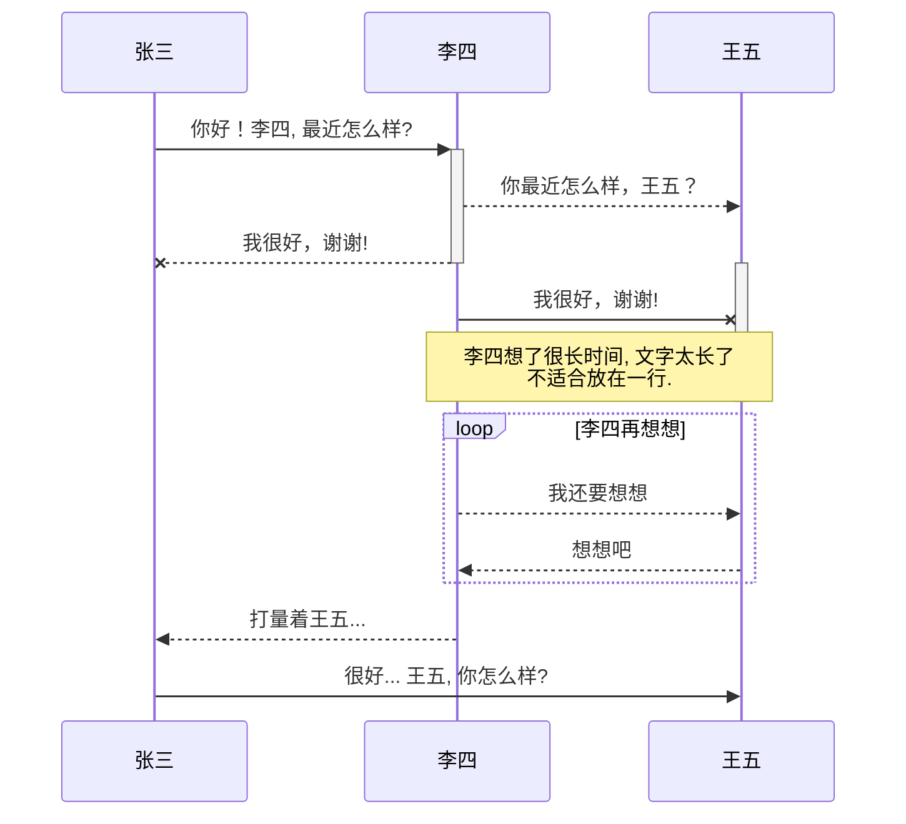

## 概要
在这里填写博客内容

```mermaid
	    sequenceDiagram
	    participant 张 as 张三
	    participant 李 as 李四
	    participant 王 as  王五   
	    张 ->> +李: 你好！李四, 最近怎么样?
	    李-->> 王: 你最近怎么样，王五？
	    李--x -张: 我很好，谢谢!
	    activate 王
	    李-x 王: 我很好，谢谢!   
	    Note over 李,王: 李四想了很长时间, 文字太长了<br/>不适合放在一行.
	    deactivate 王
	    loop 李四再想想
	    李-->>王: 我还要想想
	    王-->>李: 想想吧
	    end
	    李-->>张: 打量着王五...
	    张->>王: 很好... 王五, 你怎么样?
```	