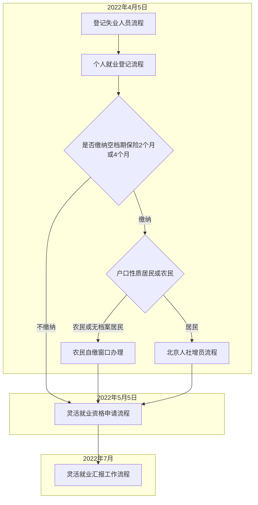

## 灵活就业个人社会保险补贴完整流程图

```mermaid
graph TB
subgraph 2022年4月5日
a1[登记失业人员流程]
b1[个人就业登记流程]
z1{是否缴纳空档期保险2个月或4个月}
w1[北京人社增员流程]
v1[农民自缴窗口办理]
y1{户口性质居民或农民}
a1 -->b1
b1 -->z1
z1 -->|缴纳|y1
y1 -->|居民|w1
y1 -->|农民或无档案居民|v1
end
subgraph 2022年5月5日
c1[灵活就业资格申请流程]
end
subgraph 2022年7月
d1[灵活就业汇报工作流程]
end
z1 -->|不缴纳|c1
c1-->d1
v1-->c1
w1-->c1
```

