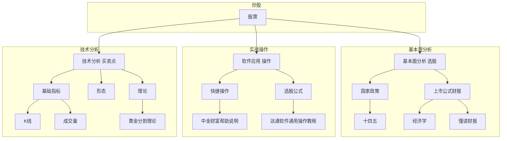

## 股票知识框架

```mermaid

graph TB
subgraph 炒股
a[股票]
end
subgraph 基本面分析
a-->b[基本面分析 选股]
b-->zhengce[国家政策]
zhengce-->book1[十四五]
b-->gongsi[上市公式财报]
gongsi-->book2[经济学]
gongsi-->book3[懂读财报]
end
subgraph 实战操作
a-->c[软件应用 操作]
c-->gongshi[选股公式]
c-->kuaijie[快捷操作]
kuaijie-->zhongjin[中金财富帮助说明]
gongshi-->datong[达通软件通用操作教程]
end
subgraph 技术分析
a-->e[技术分析 买卖点]
e-->jichu[基础指标]
e-->xingtai[形态]
e-->lilun[理论]
jichu-->kline[K线]
jichu-->chengjiao[成交量]
lilun-->lilun1[黄金分割理论]
end


```

